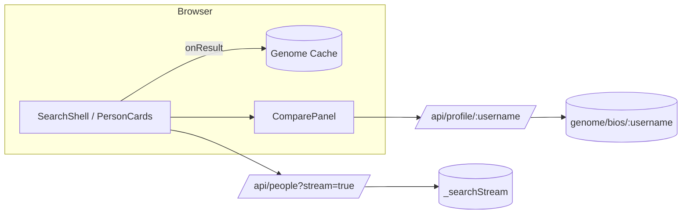

# Dream Team Builder

Streamed talent discovery, shortlist management, and side‑by‑side profile comparison with lightweight visualization (radar, strength bars) powered by Torre public endpoints.

## Current Features
- Real‑time streaming search (people or organizations) with incremental rendering (SSE proxy).
- Local shortlist(s) with add/remove and persistence (localStorage).
- Profile drawer with overview, strengths (bars + radar), roles, education, languages.
- Compare panel (up to 3 profiles) highlighting shared vs unique strengths.
- Animated, dark themed UI (Framer Motion) with toasts & skeletons.
- Genome prefetch & caching for first results to reduce open latency.
- Avatar usage across cards, drawer, comparison.
- One‑time animated radar draw & staggered result entrance (performance guarded).
- Avatar usage across cards, drawer, comparison.


## Tech Stack
- Next.js 14 (App Router; edge-compatible proxy routes)
- TypeScript + React 18
- Tailwind CSS design tokens
- Framer Motion for micro‑interactions
- Radix UI primitives (tabs, toast, scroll area)
- Server‑Sent Events (EventSource) for streaming results
- Local genome caching + concurrency‑limited background prefetch.
- Custom toast queue & compare context (pin limit = 3).
- Local genome caching + concurrency‑limited background prefetch.
- Custom toast queue & compare context (pin limit = 3).

## Getting Started
```bash
npm install
npm run dev
```
Visit http://localhost:3000 and start exploring.

## Internal API Routes
- `GET /api/people?stream=true&q=QUERY&type=person|organization` – SSE stream
- `GET /api/profile/:username` – genome proxy (60s cache)

SSE sentinel messages: `[DONE]` (stream ended), `[LIMIT_REACHED]` (server‑side cap enforced). Each `data: {"result": {...}}` is an entity.

SSE sentinel messages: `[DONE]` (stream ended), `[LIMIT_REACHED]` (server‑side cap enforced). Each `data: {"result": {...}}` is an entity.

## Torre Upstream Endpoints
- `POST https://torre.ai/api/entities/_searchStream`
- `GET  https://torre.ai/api/genome/bios/:username`

## Disclaimer
Not affiliated with Torre. Educational/demo use only.

---
## Project Structure (High Level)

```
src/
	app/
	components/
		search/
		compare/
		genome/
		ui/
		visualization/
	utils/
	tests/
	docs/
public/
```

## Architecture Overview
See `docs/architecture.md` and `docs/data-flow.md`.

Mermaid summary:


## Performance Notes
- Streaming parser yields results immediately; genome prefetch limited (CONCURRENCY=3).
- Only first 12 results get stagger animation; rest static (DOM stability).
- Radar & bar animations run once.
- Compare panel content unmounted when collapsed.


See `docs/ui.md` for animation guidance.

## Screenshots
Add images in `public/screens/` then embed below:
| Area | Image |
|------|-------|
| Search | `public/screens/search.png` |
| Drawer | `public/screens/drawer.png` |
| Compare | `public/screens/compare.png` |

## Future Enhancements
- [ ] Virtualized list for very large streams
- [ ] Shared/unique filter toggles
- [ ] Drag & drop shortlist
- [ ] Reduced-motion mode refinement
- [ ] Upgrade Next.js (security advisories)

## License
MIT (add LICENSE file if distributing publicly)
