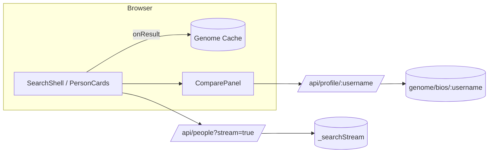

# Dream Team Builder

Streamed talent discovery, shortlist management, and side‑by‑side profile comparison with lightweight visualization (radar, strength bars) powered by Torre public endpoints.

## Current Features
- Real‑time streaming search (people or organizations) with incremental rendering (SSE proxy)
- Local shortlist(s) with add/remove & persistence (localStorage)
- Profile drawer with overview, strengths (bars + radar), roles, education, languages
- Compare panel (up to 3) highlighting shared vs unique strengths + filtering & sorting (NEW)
- Animated dark UI (Framer Motion) with performance guards & reduced‑motion awareness (NEW)
- Genome prefetch & caching for initial results to reduce drawer latency
- Avatar usage across cards, drawer, comparison
- One‑time animated radar draw & staggered initial results
- Lean bundle: PDF export & heavy libs removed

## Recently Added (This Iteration)
- Result list virtualization (react-virtuoso) for large streams
- Compare panel filters (All / Shared / Unique) & sort modes
- Reduced motion preference hook
  
## Roadmap / Next Ideas
- Drag & drop shortlist reordering (dnd-kit)
- Keyboard & screen reader refinement for compare panel grid
- Virtualized shortlist & drawer tabs (if needed at scale)
- Strength overlap visualization (Venn / matrix)
- Security: environment upgrade & upstream rate limiting

## Tech Stack
- Next.js 14 (App Router; edge-compatible proxy routes)
- TypeScript + React 18
- Tailwind CSS design tokens
- Framer Motion for micro‑interactions
- Radix UI primitives (tabs, toast, scroll area)
- Server‑Sent Events (EventSource) for streaming results
- Local genome caching + concurrency‑limited background prefetch
- Custom toast queue & compare context (pin limit = 3)

## Getting Started
```bash
npm install
npm run dev
```
Visit http://localhost:3000 and start exploring.

## Internal API Routes
- `GET /api/people?stream=true&q=QUERY&type=person|organization` – SSE stream
- `GET /api/profile/:username` – genome proxy (60s cache)

SSE sentinel messages: `[DONE]` (stream ended), `[LIMIT_REACHED]` (server‑side cap enforced). Each `data: {"result": {...}}` is an entity.

## Torre Upstream Endpoints
- `POST https://torre.ai/api/entities/_searchStream`
- `GET  https://torre.ai/api/genome/bios/:username`

## Disclaimer
Not affiliated with Torre. Educational/demo use only.

---
## Project Structure (High Level)

```
src/
	app/                 # Next.js app router pages & API routes
	components/
		search/            # Search UI (cards, drawer, stream client)
		compare/           # Compare context + panel
		genome/            # Genome cache provider (prefetch logic)
		ui/                # Design system primitives (button, tabs, toast, etc.)
		visualization/     # Radar chart
	utils/               # Small helpers (cn, streaming helpers)
	tests/               # Vitest tests (light)
public/                # Static assets (og image, favicon, screenshots)
docs/                  # Additional documentation
```

## Architecture Overview
See `docs/architecture.md` and `docs/data-flow.md` for deeper diagrams.

Mermaid summary:


## Performance Notes
- Streaming parser yields results immediately; genome prefetch limited (CONCURRENCY=3) to reduce contention.
- Virtualized result list for large sets; only visible DOM nodes rendered.
- Only first 12 results receive (optional) stagger entrance animations; skipped if reduced motion.
- Radar & bar animations run once; avoids re‑animation on tab switches.
- Compare panel hidden DOM minimized when collapsed; virtualization + filtering minimize list work.

## Accessibility & UX
- Drawer focus trap + ESC close
- Result count announced via `aria-live` region
- Reduced motion preference respected (skips stagger & complex effects)
- Color contrasts tuned for dark theme; shared/unique tags rely on color + context label

## Contributing (Quick Start)
1. `npm install`
2. `npm run dev`
3. Open http://localhost:3000
4. Run tests: `npm test`

See `docs/ui.md` for animation & styling guidelines.

## Screenshots
Place screenshots in `public/screens/` and reference below (add as needed):

| Area | Image |
|------|-------|
| Search + Results | `public/screens/search.png` |
| Profile Drawer | `public/screens/drawer.png` |
| Compare Panel (Expanded) | `public/screens/compare.png` |

*(Images not included in repo snapshot; add locally or in PR.)*

## Future Enhancements Tracking
- [ ] Drag & drop shortlist ordering
- [ ] Accessibility: keyboard nav improvements inside virtualization + compare
- [ ] Strength overlap matrix or density heatmap
- [ ] Server-side caching & ETag for profiles
- [ ] Security: further dependency & Next.js version audits

## License
MIT (add LICENSE file if distributing publicly).