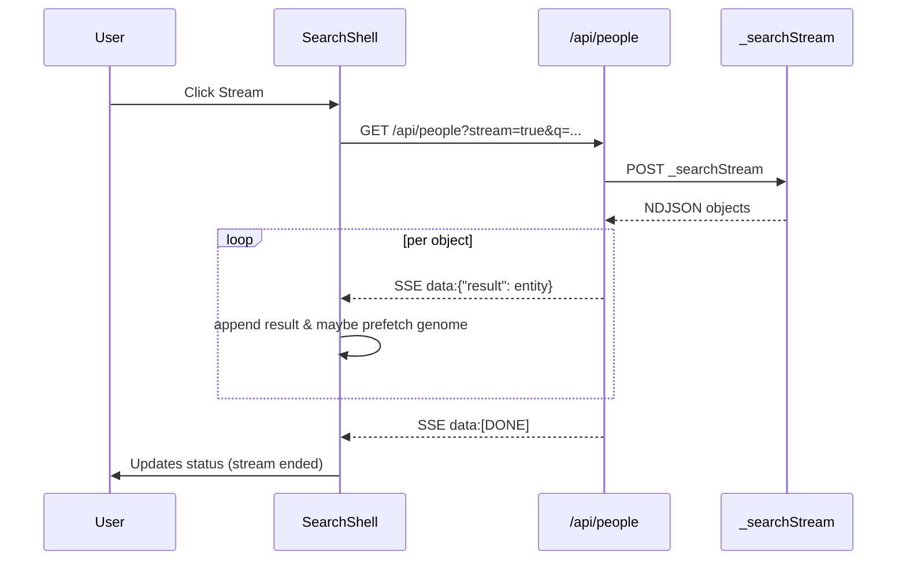
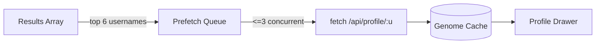
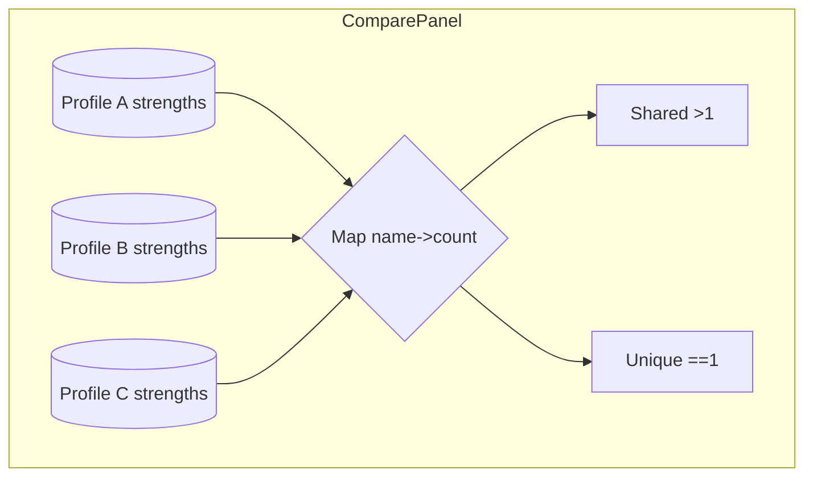

````markdown
# Data Flow & Events

## Streaming People Search


## Genome Prefetch


## Compare Strength Aggregation


## Event Summary
| Event | Source | Meaning |
|-------|--------|---------|
| result (SSE) | /api/people | One search entity mapped |
| [DONE] | /api/people | Upstream ended normally |
| [LIMIT_REACHED] | /api/people | Local limit satisfied early |
| toast push | UI actions | Feedback (pin/save/remove) |

````
